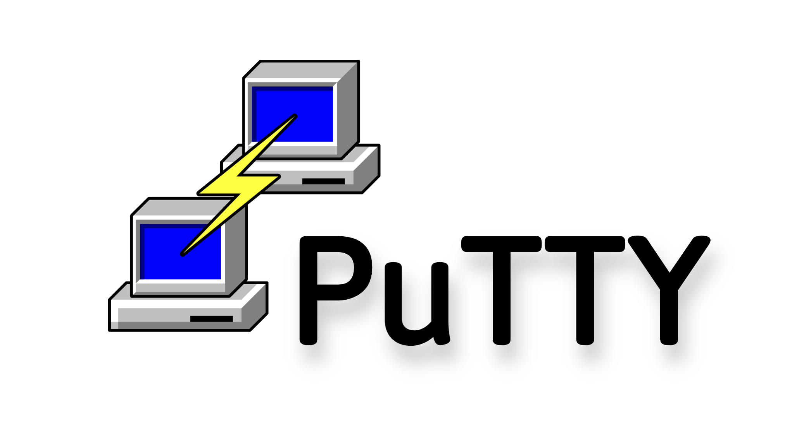

### 👋 Hi, I’m Meerim — a QA Automation Engineer with a passion for building reliable test systems and delivering high-quality software.

ISTQB Certified | Java + Python | Mobile, Web & API Automation | Remote-ready

<!--About me-->

### 👩‍💻 About me

I’m a QA Automation Engineer with hands-on experience in testing mobile, web, and API applications.  
I’ve built test automation frameworks using Java, Python, Selenium, Appium, and Rest Assured.  
- Automated regression testing for Android app, reducing manual QA effort by 60%  
- Created reusable test modules and CI pipelines with Jenkins & Allure reporting  
- Worked in Agile teams with Jira, Confluence, and Git-based workflows  

A quick learner thriving under pressure, committed to perpetual growth. Let's connect for a productive chat on QA insights and explore collaboration opportunities! 🌐

- Contacts:

  &#8287;&#8287;&#8287;&#8287;&#8287;
  
  &#8287;
  
  
  

<!--Stack and tools-->
&#8287;&#8287;&#8287;&#8287;&#8287;
## :computer:Stack and Tools:

  <code></code>
  <code></code>
  <code></code>
  <code></code>
  <code></code>
  <code></code>
  <code></code>
  <code></code>
  <code></code>
  <code></code>
  <code></code>
  <code></code>
  <code></code>
  <code></code>
  <code></code>
  <code></code>
  <code></code>
  <code></code>
  <code></code>

**Hard Skills**: Programming languages (Java , Python),JUnit, Maven, Gradle, PostreSQL, Test Automation (Selenium, Appium), Manual Testing (Postman, DevTools), CI/CD (Jenkins, Git), Version Control (Bitbucket,
GitHub), Agile Methodologies, JSON, Android Studio,Allure TestOps, Bug Tracking (Jira).

**Soft Skills**: Demonstrates continuous learning, effective time management, collaborative teamwork, meticulous documentation,
acute attention to detail, and adaptability.

**Languages**: English - Advanced, Russian - Fluent

### 📬 Open to:
- Remote QA Automation roles (worldwide)
- SDET, QA Engineer, Test Automation
- Contract / Full-Time / Freelance

<!--Education-->

<!--Projects-->

### 📦 [API Automation Project (GoRest API)](https://github.com/Meeerim/gorest_autotests_api.git)
Automated testing of GoRest API using Python, Pytest, and Allure. Includes schema validation, CRUD operations, and custom reporting.

### 💻 [UI Automation Project (Udemy Web App)](https://github.com/Meeerim/udemy_autotests_web)
Web automation tests using Selene + Selenium for the Udemy platform. Custom assertions, modular test structure, and Jenkins integration.

## :woman_student:Education
<table width="100%" border='0'>
   <tr> 
    <td width="30%" valign="bottom"></td><td valign="middle">Bishkek Academy of Finance and Economics.  Management.</td></tr>
  </table>
   
   
 #### Additional Education:
<table width="100%" border='0'>
   <tr><td width="30%" valign="bottom"></td><td valign="middle">School of Test Automation Engineers <a target="_blank" href="https://qa.guru">qa.guru</a>.</td></tr>
  <tr>
  <td width="30%" valign="bottom"></td>
  <td valign="middle">ISTQB Foundation Level Certification — International Software Testing Qualifications Board</td>
</tr>
  </table>

  

<!--Git Stats-->

&#8287;&#8287;&#8287;&#8287;&#8287;
## :bar_chart:Git stats

 

